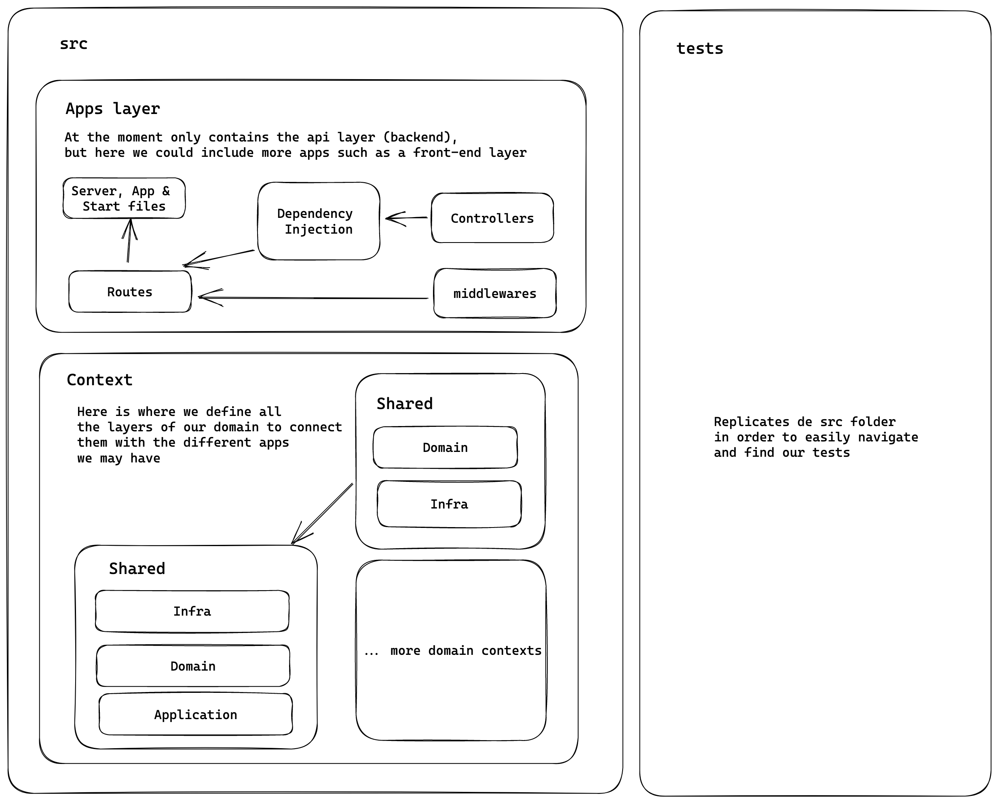

# news-feed-api

API build with Node-TS following, DDD Hexagonal Architecture and OOP best practices.



## About the project

The api allows the user to create news and store the main 5 feed news from different Spanish newspapers (Elmundo & ElPais) for now.

To get the news it's used puppeter at the moment as axios was having some enconding problems and cheerio for handling the request and parsing the data.

The architecture allows to easilly increase the number of newspapers to be scrapper using a ScrapperFactory.

## Features

- [TypeScript](https://www.typescriptlang.org/) (v4)
- [Prettier](https://prettier.io/)
- [ESLint](https://eslint.org/) with:
  - [Codely's config](https://github.com/lydell/eslint-plugin-simple-import-sort/) (includes ESLint's recommended rules, Prettier, Import plugin and more)
  - [Jest plugin](https://www.npmjs.com/package/eslint-plugin-jest)
- [Jest](https://jestjs.io) with [DOM Testing Library](https://testing-library.com/docs/dom-testing-library/intro)
- [GitHub Action workflows](https://github.com/features/actions) set up to run tests and linting on push
- [Supertest]() for integration testing
- [Express.JS](https://expressjs.com/es/)
- [Mongodb](https://mongo.com/) as db
- [Cheerio](https://cheerio.js.org/) to parse the request data
- [Axios](https://axios-http.com/) and [Puppetter](https://pptr.dev/) for page crawler

## Working with this project

The following are the instructions to set up the API project locally.
To get a local copy up and running follow these simple example steps.

- Run the app: `yarn dev`
- Install the dependencies: `yarn install`
- Execute unit tests: `yarn test:unit`
- Execture integration tests: `yarn test:int`
- Check linter errors: `npm run lint`
- Fix linter errors: `npm run lint:fix`

> !IMPORTANT

You need to provide the database connection in order for the persistance layer to work, can either be a local or an atlasdb mongo instace.

<!-- USAGE EXAMPLES -->

## Usage

API docs.

- Feed model

```json
{
  "id": "0766c602-d4d4-48b6-9d50-d3253123273e",
  "title": "Feed title",
  "description": "Feed description",
  "url": "https://example.com",
  "image": "https://example.com/image.png",
  "source": "ELMUNDO",
  "author": "",
  "location": "",
  "date": "2021/03/07"
}
```

### Main routes

- PUT /feed

  ```txt
   Create and udpate the feed
  ```

- GET /feed/:id

  ```txt
   Gets feed by :id
  ```

- DELETE /api/feed/:id

  ```txt
   DELETE feed by :id
  ```

- GET /api/feed-scrapper?type="sourcetype"
  ```txt
   Get 5 feeds from the selected sourcetype and saves it into the database
  ```

## Manual Testing

[Postman colletion](assets/DailyTrends.postman_collection.json)
